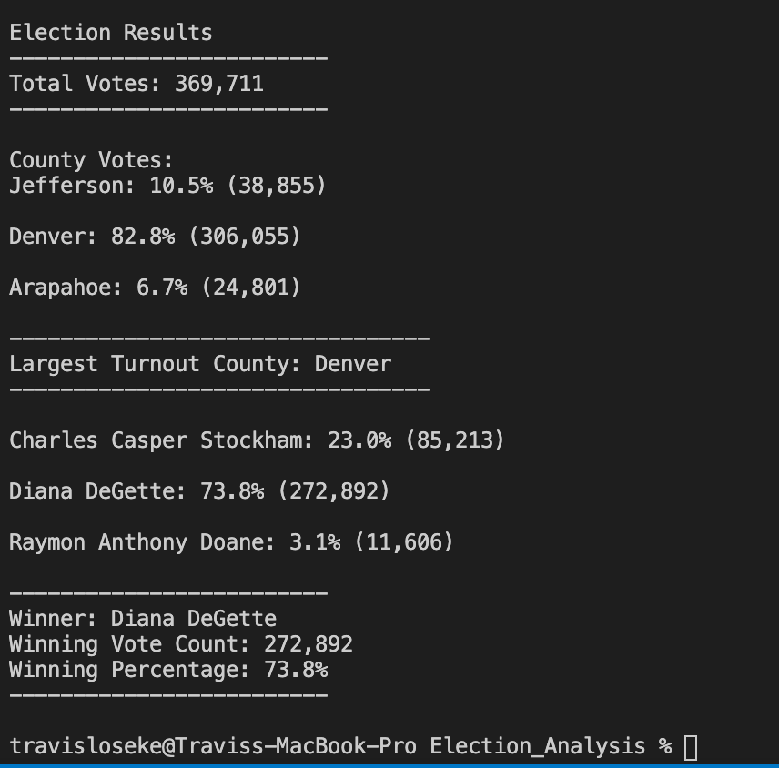

# Election_Analysis

## Overview of the Election Audit
The purpose of the project was to audit election results in Colorado election.  A csv file was provided with the voting data.  Pyhton code was written to read the vote counts, count the votes by candidate and county to determine the winner based on the popular vote and examine voter turn out by county.  A summary of the results was written to a text file and can be found here: 
[Election_results](Analysis/election_analysis.txt)

To run the code the python file is located here:
[Python_Election Code](PyPoll_Challenge.py)
 

### Election Audit Results:

  1) Total Votes Cast: 369,711
  2) County Vote total summary:
    
     |County   | Votes Cast:  | Percentage of Total Vote|
     |-------  |--------------|-------------------------|
     |**Jefferson**| 38,855       |10.5%|
     |**Denver**  | 306,055      |82.8%|
     |**Arapahoe** | 24,801       |6.7%|
    

  3) Denver County has the highest total votes with 82.8% of the vote and 306,055 total votes.

  4) Candidate votes were as follows: 
     |Candidate Name  | Votes Cast     | Percentage of total vote|
     |----------------|----------------|-------------------------|
     |Charles Casper Stockham | 85,213 | 23.0% |
     |Diana DeGette | 272,892 | 73.8% |
     |Raymon Anthony Doane | 11,606 | 3.1%|

  6) Winner of the election is Diana DeGette with 272,892 votes and 73.8% of the total vote.

Election results can also be found here:

[Election_results](Analysis/election_analysis.txt)

  

### Election Audit Summary:
The python script can be easily modified to adapt to future elections.  Rather than redo the coding for future election, some simple changes to this code will make this adaptable for an election with columnar style data.  The recommendation is to purchase the code now to save on future election costs.  Below are two simple ways to adapt the code for future elections:  

1) Simply redirect the code to read and import the correct elections data file:
Editing the path:

   `import csv
    import os

    # Add a variable to load a file from a path.
     file_to_load = os.path.join("Resources", "election_results.csv")`

Replace election_results.csv with the new name and edit the file path to include the correct directories.

2) Second be sure the columns are in the correct position within the index for the candidate name:
    
   `for row in reader:

     # Add to the total vote count
      total_votes = total_votes + 1

      # Get the candidate name from each row.
      candidate_name = row[2]

      # 3: Extract the county name from each row.
      county_name = row[1]`
      
      
      
Note that in this case the county column is in the second position or index (1), and the candidate names are in the third column or index position (2).  If the election data is in different columns just change the index values to the correct index for county and candidate.  If the election if by precinct and not county the text may also need to be changed to reflect the aggregation for the precinct instead of county designation.
  

